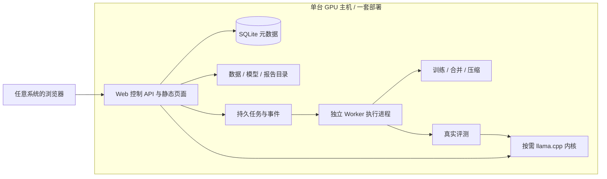

# SystemOneStudio 技术方案

> 2026-10-06 用户补充：GPU 主机可能运行 Windows，不限定 Linux 宿主。部署首选复用同一套 Linux 容器：Linux 直接运行，满足 NVIDIA / WSL2 条件的 Windows 主机通过 Docker Desktop 运行。Windows 原生 Python 与推理工具链作为独立待验证路线，不宣称已兼容。当前优先交付单 HTML 交互 Demo，待界面反馈后继续业务实现。

版本 T2，2026-10-06，已于 2026-10-06 获用户整体批准。依据 `需求重整.md` R2 与 `项目审计.md`，已按用户五项意见调整。推荐首版为 GPU 服务器上的一体应用，Web 操作不与 Windows 绑定；远程轻代理是后续部署形式，不作为首版交付依赖。

## 1. 选型与部署取舍

保留 React/Vite/TypeScript/TanStack Query、FastAPI/Pydantic、SQLAlchemy/SQLite、文件资产、模型适配器及有效 Python 能力库。首版单用户、单 GPU 执行节点、一个 GPU 长任务槽位，不建设集群和多租户。

| 形式 | 优点 | 代价 | 本阶段决定 |
|---|---|---|---|
| 一体部署 | 同一节点访问数据/模型；安装与排查简单；不用跨机传输/对账 | 关租后控制面也离线；必须导出或使用独立持久盘 | 推荐交付并完整验收 |
| 常驻 Web 控制面 + 轻执行代理 | 控制面长期保存项目，按需租 GPU | 跨机认证、文件传输、断线事件与结果回收仍需实现 | 留好接口，后续有常驻需求再交付 |

二者都技术可行。控制面占用 CPU，不必须位于 Windows，也不必须与 GPU 分机。一体部署与代码职责分离不冲突：安装是一个产品，内部仍用独立执行进程，不能在 HTTP 请求中训练。

首版交付一份 Compose 配置、一个锁定版本的 GPU 应用镜像、一个入口及一个持久工作目录。镜像含构建后的 Web 静态文件、控制 API、任务执行器与 GPU 运行依赖；内部启动 API 和 Worker 子进程，按需启动 llama-server。进程有独立日志、退出监视和受控停止。无需额外 nginx/Redis/PostgreSQL/MinIO/Prefect/Celery 服务即可完成首条链路。

Web 服务默认只监听主机私有入口，由 SSH 转发供浏览器访问；需要对外访问时显式配置访问令牌及 HTTPS 接入。llama-server 只供平台内核使用，不独立公开管理端口。本阶段无多租户认证平台，不等于把无认证训练/数据接口开放公网。

## 2. 快速部署的实际实现

发布时预构建多阶段镜像：前端构建；CUDA devel 编译锁定 llama.cpp；安装锁定 GPU Python 依赖和 workspace 包；最终 runtime 只带运行文件。租赁节点拉取发行镜像，不现场编译工具链或用未锁定 pip 最新包。torch、transformers、PEFT、TRL、accelerate 等另设 GPU 依赖锁，控制面开发环境不强装 GPU 重依赖。

宿主仍需兼容 NVIDIA 驱动、容器运行时和 GPU 透传；Compose GPU 能力依赖这些环境条件，启动脚本要检查并给具体错误。[Docker 官方 GPU 部署说明](https://docs.docker.com/compose/how-tos/gpu-support/)

使用一个配置文件指定持久目录、端口、模型缓存和可访问范围。模型 repo/revision 准确映射，支持提前准备模型文件与缓存；`HF_HOME/HF_HUB_CACHE` 指向持久目录，模型下载与正在训练分开显示。[Hugging Face 官方缓存变量](https://huggingface.co/docs/huggingface_hub/main/en/package_reference/environment_variables)

安装脚本执行检查、创建目录、拉镜像、启动、检查 API/Worker 能力；失败不吞掉退出码。应用能启动与 GPU 能训练分别判断，不因 /health=200 就显示训练就绪。当前 `python -m son_worker` 缺子命令等问题在该工作包修复。

验收冷部署和有缓存的启动恢复，记录镜像大小、拉取、模型准备和应用就绪耗时。网络、模型大小、驱动会影响首次部署，不承诺普适秒级启动。

## 3. 持久化、导出和关租

SQLite、场景/运行、种子与合成、checkpoint、报告、模型产物放到容器外工作目录。SQLite WAL 的访问进程都在同一宿主，不从网络文件系统跨主机访问。[SQLite WAL 说明](https://www.sqlite.org/wal.html)

容器卷帮助重建容器后保留数据，不能保证租赁实例被销毁后数据仍在。独立云盘能否跨租期保留由提供商条件决定，当前不假设存在。首版必须支持应用级工作区导出/恢复：

- 导出前暂停新任务提交；明确处理正在执行的任务，不能声称把运行中的 GPU 进程打包带走。
- 用 SQLite 一致性备份与已提交不可变资产生成包，不直接拷贝正在写的 db 文件。
- 导出包含 Schema、sc/ds/syn/mv 关联、配置、日志/报告和选择的产物；逐项 hash/大小校验，记录未包含缓存与依赖。
- 导入校验版本和完整性，重映射目录，恢复后部署进程默认待启动，不能复制旧 PID/SERVING 状态。
- 训练断点恢复需要基座 revision、训练栈版本与相容 checkpoint；只导出 adapter/GGUF 不等于能继续训练。

“导出模型”用于独立推理交付，“导出工作区”用于继续使用平台，二者分别解释。首版不自动退款、退租、删除云资源或连接对象存储。用户完成保存后自行释放服务器。

## 4. 控制主体与最小执行器

控制主体拥有项目、场景、数据配置、流程、版本、报告、导出和 Web。执行器只接受明确任务配置与资产引用，执行数据扩增/训练/合并/量化/评测及推理生命周期，返回事件、日志、测量和产物 Manifest。它不拥有场景页面、助手、账号系统或第二套产品状态机。

本阶段内部 Executor 接口只定义 submit/status/events/cancel/result/service 这些能力；使用本地持久队列和子进程实现，不先建设远程 HTTP 协议。Job、RunEvent 和产物回写进入同一控制面应用服务；浏览器不推进完成态。后续远程代理复用同一任务契约，经网络适配器解决传输与对账，不能远程打开主库。

“代理轻”意味着业务职责小。训练依赖、模型缓存、日志、断点仍存在于执行节点；它不会因为叫代理就变成几 MB 的环境。

代码依赖保持契约唯一来源：`libs/contracts` 负责任务/事件/Manifest/Schema；能力调用在应用组合层通过公共入口组织，服务内部不互相 import。场景/Run 类型从 OpenAPI 生成，移除前端手写镜像。旧模块可复用，不把现有协议基础全部推倒重写。

## 5. 领域模型与七步状态

保留 Project、Run、Dataset、Split、Synth、Job、ModelVersion、Artifact、Evaluation、Deployment、Audit。场景改为用户名称/描述与上传推导的 SceneSnapshot（schema、字段角色、映射、两开关、提示版本）。不依赖 SCENE_TEMPLATES 或反诈 32 字段。

Run 保存一套可追溯配置和阶段资产；执行尝试有 attempt_id、配置 hash、执行标识、心跳、最后事件和恢复信息。资产按 run/attempt/asset 目录保存，先 .partial，校验后原子提交与登记；禁止重试覆盖已登记文件。

七步导航是 UI 阶段；每个阶段另有草稿、就绪、执行中、成功、失败和过期状态。训练/合并/压缩不是更多用户步骤。执行过程示意：

`DRAFT → SEED_READY → [SYNTHESIZING → TRAIN_SET_READY] → CONFIGURED → QUEUED → TRAINING → MERGING → QUANTIZING → ARTIFACT_READY → EVALUATING → EVALUATED`

模型导出与部署拥有各自状态，不强制模型必须 SERVING 才能下载。失败/中断/取消中/已取消与连接状态分别记录；Job、Run 与事件更新一致。只有实际停止训练子进程才标已取消。

可回看任一步；未就绪页给出依赖，禁用执行动作。修改上游生成新数据/配置版本并标记下游待重算；历史训练不被改写。服务器重启先检查执行器与 checkpoint/产物，再决定中断或恢复，不用旧状态直接宣称继续。

## 6. 通用种子、数据合成与训练语义

场景描述进入统一 system prompt 的任务定义，输入字段来自种子 Schema，模型输出固定三分类契约。支持表格 CSV 和规范化 input/decision/reason CSV；第一版的真实合成验收以表格数据为基线。复杂文本的语义扩写不作无条件支持承诺。

上传识别类型、列角色、中文三类标签与依据来源；歧义通过同页确认。只 lower/strip 不足以映射标签，必须写回 canonical decision。标签/目标依据/评分/置信度不进入提示，ID 默认非特征。reason 没有监督时不填固定模板；用户需补充依据，或明确确认可执行生成规则后记录弱监督来源。示例包含规范、可核验的依据，不作为业务模板。

seed 先固定 7:1.5:1.5，再从 train 扩增，test 完全隔离；小样本、近重复、同实体跨集冲突必须报告。第一版合成按标签条件做整行与联合结构保留、受约束数值扰动；原依据必须与扰动后的输入一致，否则拒绝该候选。不得随机重贴标签或依靠复制行数量冒充有效新样本。

算法与 UI 明确区分“合成完成”“分布报告”“效果改善”。前两项可测不意味着第三项成立。不为了证明扩增有效对每个租赁任务强制两次全量训练；发行验收用固定通用数据做 seed-only/扩增验证对照，用户运行报告有无对照证据；test 不参与选方案。

## 7. 模型/方法与真实执行

首先跑通 Qwen2.5-1.5B-Instruct + LoRA SFT 基线，再在同一适配器中验证 Qwen 3B、QLoRA 路径。UI 只开放已验证且当前 GPU 适用的组合，推荐默认能一键接受；模型卡“登记了”不等于可训练。

训练、验证、测试和预测共享场景快照、字段选择、JEV 开关、提示模板与聊天模板。实际配置传入 trainer，validation 用于训练监控与 checkpoint 选择；记录截断、loss、步数和资源。loss mask 及恢复 API 按最终锁定 TRL 版本配置。[TRL 官方 SFT 文档](https://huggingface.co/docs/trl/v0.28.0/en/sft_trainer)

reason 保留标注或规则来源。score/confidence 有真实监督时训练；缺失时不造固定监督常数，保留为模型自报字段并明确未校准。格式目标与可信概率是两项能力，训练目标构造与 loss mask 要防止把任意补值当有效监督。

Worker 驱动完整生产链：训练 → 验 adapter → 合并 → Q4_K_M → 加载探针 → 版本/产物登记 → 真实测试推理 → 保存评测。各阶段在可终止子进程执行，结束释放 CUDA，后续从已提交资产恢复。模型可加载与产物 hash 必须同时证明，文件非空不能作为唯一验证。

## 8. 测试、试用与部署

验证阶段由平台内部临时推理服务完成，用户无需先对外部署。内部服务不能混同“业务服务已上线”；只对选定模型启动并控制资源，同 GPU 训练与试用争用时给出等待/暂停说明。

llama-server 为内核；平台 FastAPI 提供 `/v1/predict`、Swagger、版本路由和结果校验。服务器的 `/v1/chat/completions` 等路由不会自动成为本平台预测契约。[llama.cpp 官方服务说明](https://github.com/ggml-org/llama.cpp/blob/master/tools/server/README.md)

评测用冻结 test 推理；不接受手填 y_pred 作为产品报告。保存真实原始输出、错误、分母和计时，未知真值拒绝计算。展示全量有效判定率、格式率、合规回答条件准确率、三类明细及错误案例；失败样本不从整体有效性分母消失。性能先于效果：平台入口到完整 JSON 返回，另报内核/TTFT，固定硬件/长度/并发/预热条件，未测项不打勾。

导出动作生成完整 Manifest/元数据/模型/报告包；下载校验和与兼容环境提示可见。部署启动、停止与重启独立记录；进程健康且业务探针成功才 SERVING。导出失败或部署失败不能使整个已训练模型消失。

## 9. 开放工作台

同一 Run 路由固定顶部七步导航，中央按阶段显示场景编辑、数据表、合成对比、训练配置、训练监控、评测/试用、导出部署。右侧参数抽屉、底部日志折叠；不默认常驻多侧栏压缩工作区。

用户可在任务执行时回看数据或检查结果。顶部阶段导航不是单向“下一步”页面，也不是随意改变任务依赖。视图位置可本地保存，业务完成态来自 API。草稿保存与业务生成动作分开，重复上传/开始防抖与幂等。

首版轮询或事件补读即可，不为了炫酷先建设复杂实时基础设施。视觉使用统一 tokens/字级/图表/状态动效；完整设计七步与失败、空、过期、取消中、恢复态。无助手布局与模型提供商配置；保留已有助手数据但第一版不挂产品路由，不调用第三方模型。

## 10. API 收敛与助手退出

场景 create/update 为名称/描述，不查询业务模板才能建 Run。完善运行级 dataset/data-config、synth、training-config、preflight/start、cancel/retry/resume、事件/日志、evaluation/playground、export/deploy/stop 与 `/v1/predict`。增加工作区 export/import 与能力检查；首版不开放多节点管理。

接口由契约生成，HTTP multipart 必须修复。旧项目/场景/审计统一持久化。助手退出包含前端入口、默认面板、系统设置、API 注册和运行时依赖；历史配置保留备份，不删除数据来简化测试。旧 standalone 数据/手填评测 API 明确迁移，不让其绕过运行血缘。

## 11. 验收与延后边界

真实 GPU 上依次验证：发行镜像部署、基线短训练、通用场景七步、合成与关系保护、模型/方法组合、真实评测/预测、取消恢复、模型导出独立加载、工作区恢复与完整视觉交互。

CPU 替身可验证状态/幂等/故障，不能证明 GPU 运行。E2E 不得直接写 DB 代替生产登记。保留三分类、reason、测试集隔离等已有保护性测试。

延期：分机代理网络适配、业务模板、智能助手、任意画布、复杂文本合成、多模型族、DPO、集群、多租户。第一版以职责边界而不是未使用的远程协议为以后留余地。
